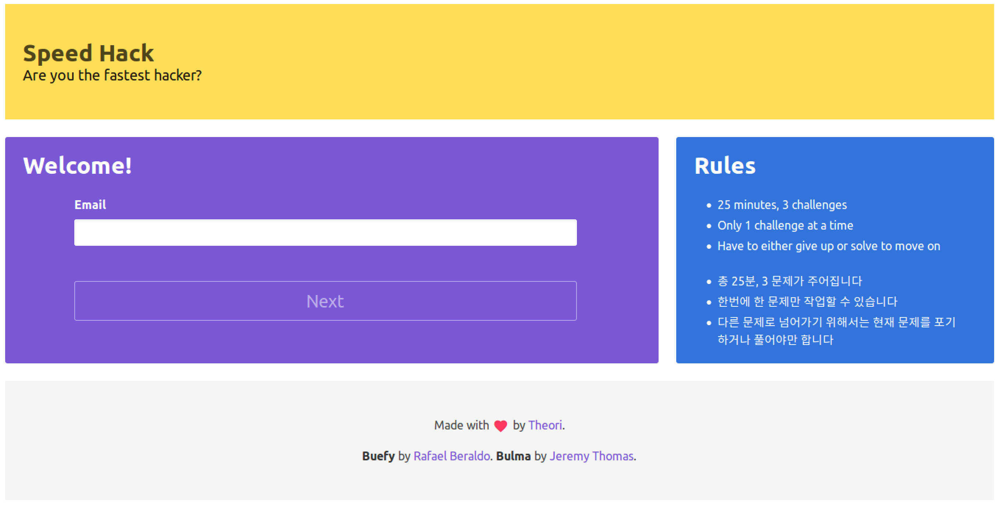
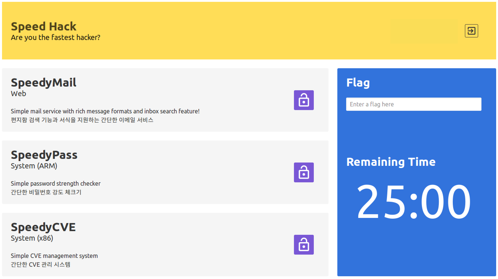

# Speed Hack - POC2017 Edition

At [POC2017](http://powerofcommunity.net/), Theori organized an event called **Speed Hack**.

The purpose of the event was to have hackers try to hack as fast as they can. They were given total of 3 challenges with 25 minute time bank.

The on-site event was largely successful, but due to limited time, not everyone could try and show off their hacking skills. As some participants wanted to continue to try at home as well, we prepared an online version for people to play with. The site (http://speedhack.theori.io) will be up till November 12, 2017.

Here, we provide an official write-up of each challenge and their solutions.

Enjoy!