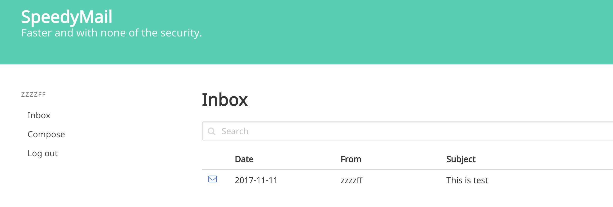
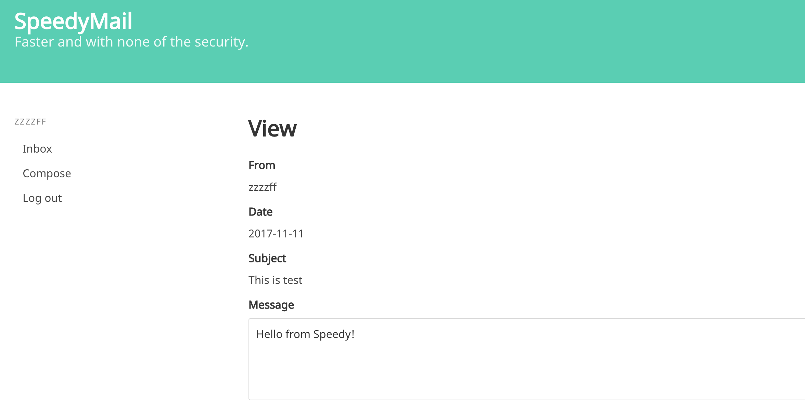
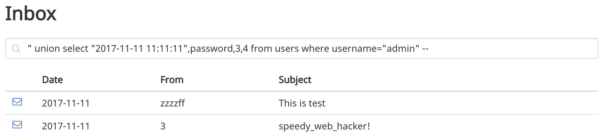
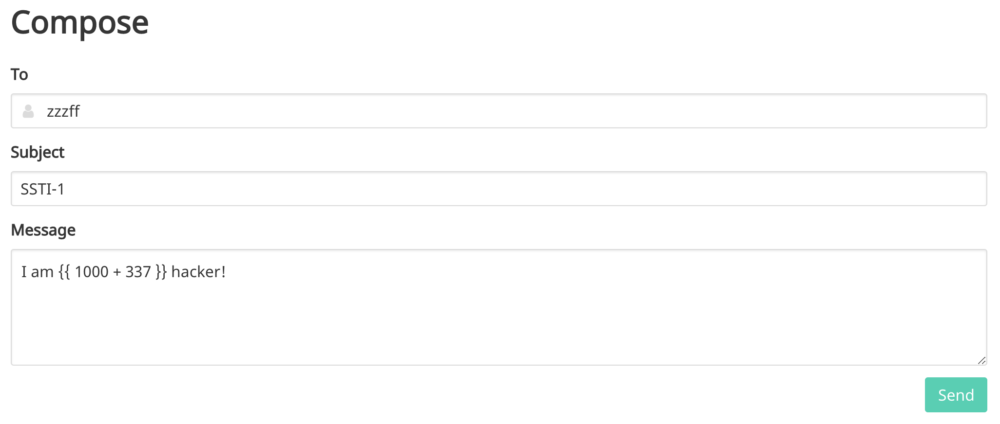
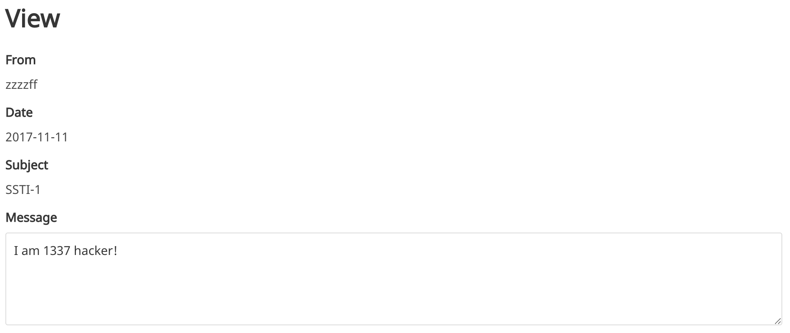
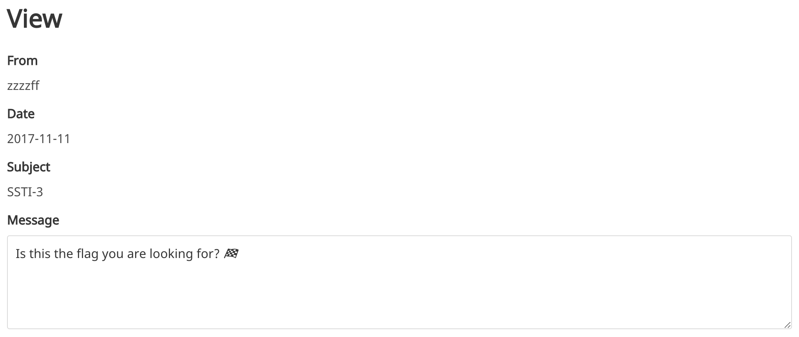
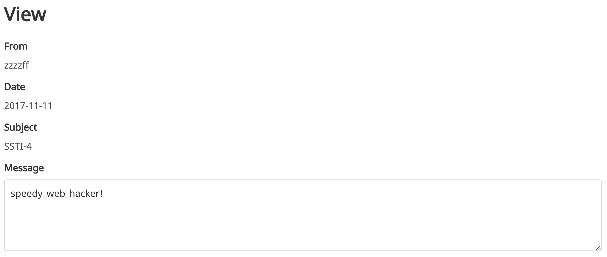

# SpeedyMail

### Web

SpeedyMail is a simple web service that provides its users with email features such as composing and reading messages. The challenge provides the [source code](app.py_935d48beeeacae5e7db8c452842638a4) for the application. The goal is to figure out the admin's password.


There are a couple different ways to approach for this challenge. First, let's sign up and log in to see what we can do on the web app. After composing an email to ourselves, we can see the email showing up in our inbox.




Clicking on an email icon to the left displays the content of the selected email.




#### Vulnerability #1 (SQL Injection)

From reading the source, we can easily locate an SQL injection bug.

```python
...

@app.route('/')
def index():
    user = get_user()
    if user is None:
        return redirect(url_for('login'))
    c = db().cursor()
    q = request.args.get('q', '')
    c.execute('SELECT date, subject, users.name, messages.id FROM messages JOIN users ON messages.from_user_id = users.id WHERE to_user_id = "%d" AND subject LIKE "%%%s%%"' % (user['id'], q))
    messages = [{
        'date': datetime.strptime(x[0], '%Y-%m-%d %H:%M:%S'),
        'subject': x[1],
        'from': x[2],
        'id': x[3],
    } for x in c.fetchall()]

...
```

The bug is in `index()` method that handles the default root route. This is also where the search query is used. On line 130, the SQL query is created with a user-supplied input (`q`) without any filter or validation. This allows us to inject arbitrary SQL query in `LIKE` clause.

With `union` query, we can easily fetch the admin user's password. However, we should be careful about the python code that follows the SQL query we executed. The `date` field in message object tries to parse the first column, which is `date` column, in specific format — namely, `%Y-%m-%d %H:%M:%S`.

So the queries like `" UNION SELECT 1,2,3,4 --` will fail because the first column is not in the right format. The correct way to inject and leak out the admin's password looks like this:

```
" UNION SELECT "2017-11-11 11:11:11",password,3,4 FROM users WHERE username="admin" --
```




We found the flag: `speedy_web_hacker!`


#### Vulnerability #2 (Server-Side Template Injection)

This Flask app makes use of Jinja2 template engine. In `view()` method, which displays an email detail, we find an SSTI vulnerability. Specifically, on Line 278, the web app blindly trusts user-controllable input (`row[3]`, aka message body) and uses it as part of the server side rendering.

```python
...
    return render_template_string(MAIN_HEADER + '''
<h1 class="title">View</h1>
    <div class="field">
        <label class="label">From</label>
        <div class="control has-icons-left">
            {{ from_name }}
        </div>
    </div>
    <div class="field">
        <label class="label">Date</label>
        <div class="control has-icons-left">
            {{ date.strftime('%Y-%m-%d') }}
        </div>
    </div>
    <div class="field">
        <label class="label">Subject</label>
        <div class="control has-icons-left">
            {{ subject }}
        </div>
    </div>
    <div class="field">
        <label class="label">Message</label>
        <div class="control has-icons-left">
            <textarea class="textarea" readonly>''' + row[3] + '''</textarea>
        </div>
    </div>
    ''' + MAIN_FOOTER, user=user, from_name=row[2], subject=row[1], date=datetime.strptime(row[0], '%Y-%m-%d %H:%M:%S'))

...
```

This results in a serious security vulnerability where we can access the context the template engine has at the time of rendering, or run python code. In order to test this, we can send an email to ourselves again with the following content.



When we read the above message, we see the following.



We can tell that the expression we put in the template was evaluated.

One of the context object that is exposed to the template engine is `config`. The `config` object is passed in from Flask, and contains interesting items inside. By providing `{{ config }}` as a message, we get this.


Of these interesting items in `config` object, we see the `DEBUG`, `SECRET_KEY`, and `FLAG`(!).

```python
c.execute('INSERT INTO users (name, username, password) VALUES (?, ?, ?)', ('Administrator', 'admin', str(app.config['FLAG'])))
```

On Line 419, we see that admin's password was read from the app's config. So can we read out the flag through SSTI? Let's pass in `{{ config.FLAG }}` and find out what we get.



It displays an emoji of the flag. Definitely not the flag we were looking for. Then, we notice that `str` method is called when `app.config['FLAG']` was accessed. The `config.Flag` object seems to implement both  `__unicode__` and `__str__`. Let's try again with `{{ config.FLAG.__str__() }}`.





Yay, flag.

